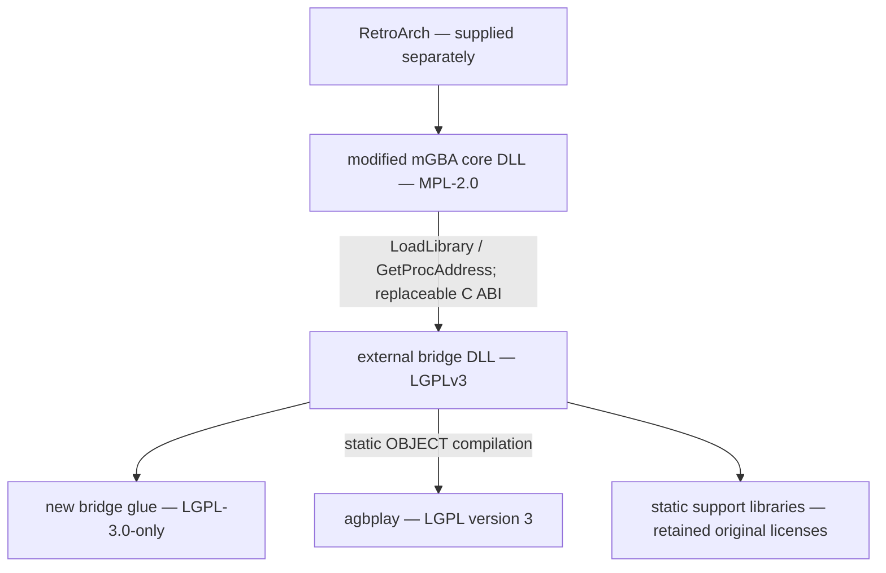

# v0.3 RC license and source audit

The local RC retains the original MPL-2.0 emulator license, separate LGPLv3 bridge/agbplay and GPLv3 texts, and the dependency notices and preferred sources described in THIRD_PARTY_NOTICES.md. No component is relicensed.

The bridge is rebuilt with the supplied relink-support headers/static archives. Its matching glue, pinned agbplay sources and six support dependency sources/recipes are included. Boost's distributed headers are themselves editable preferred source, with the Boost Software License retained. GCC runtime exception and Windows-system import boundaries retain their existing notices.

The compatibility metadata retains CC BY-SA 4.0, No-Intro/libretro attribution, source revision/hash and modification notice. No-Intro terms were rechecked on 2026-10-09. Metadata terms do not grant rights to game ROMs, firmware, audio or video.

The packaging license-material validator compares original license texts, source inventories, bridge/source consistency and actual per-file hashes. A separate relink test modifies agbplay only in an isolated private copy, rebuilds from packaged sources/support and loads the replacement with the unchanged RC core. The test mutation is never included in distributed source.

See V03_RC_VALIDATION.md for the completed results and limitations. The recursive package/Git auditor checks source archives and object history as well as visible filenames. This technical audit does not certify ownership of third-party game content; no ROM, firmware, save or state data is included. Approved game demonstrations are separate Release assets; user-confirmed rights are recorded in V03_DEMO_REVIEW.md.

## Retained v0.2 component compliance ledger

The following is preserved historical component analysis and evidence. It is retained for licensing/relink detail, not as a claim that its old binary is the new RC. Current RC results above and V03_RC_VALIDATION.md identify the freshly built core.

# Original local Preview license audit — 2026-10-03

Scope: this Windows ZIP, its two runtime DLLs, their source/build inputs, license
notices, and the ability to use a modified linked library. This is a technical
check against the supplied original license texts, not legal advice or a
determination of copyright ownership. Original mGBA and agbplay code is not
relicensed. The project owner authorized licensing the newly authored glue.

## Actual binary/source boundaries



The core and bridge are separate PE binaries. The core does not import an
agbplay/bridge DLL at PE load time. `libretro.c` loads the bridge path from
`MGBA_MP2K_BRIDGE_PATH` and resolves C functions dynamically. The bridge's
CMake recipe compiles agbplay as an **OBJECT** target into the bridge SHARED
target; this is static inclusion, not a separately replaceable agbplay DLL.
Observed portable imports are Windows system DLLs only.

All bridge implementation is `bridge.cpp`; `bridge.h` defines the C ABI;
`CMakeLists.txt` supplies configuration, 20 translation units, includes and
link inputs. The 20 agbplay units are:

```
CGBPatterns.cpp Debug.cpp FileReader.cpp Gsf.cpp LoudnessCalculator.cpp
MP2KChn.cpp MP2KChnPCM.cpp MP2KChnPSG.cpp MP2KContext.cpp MP2KPlayer.cpp
MP2KScanner.cpp MP2KTrack.cpp Resampler.cpp ResamplerAVX2.cpp
ReverbEffect.cpp Rom.cpp SequenceReader.cpp SoundMixer.cpp Types.cpp Xcept.cpp
```

## Original license evidence and provenance

- Root mGBA `LICENSE`: MPL-2.0, preserved byte for byte. Existing modified
  mGBA files retain their original notices; the ten new internal clock/MP2K
  C/header files, including the profile layer, carry MPL notices. The original
  audit used the human-validated AAMJ tag. Subsequent experimental profile/bridge
  API v2 changes retain these licenses and the same separate-binary boundary.
- External agbplay: clean revision
  `0b87da48d2502da359e45718eec8566ac40fa9d7`; root license is LGPL version 3.
  Its About source credits ipatix and contributors, 2015 onward. No additional
  "or later" permission was located; this package does not infer one.
- The three original glue/build files were introduced in `ea27cf93e` and
  subsequent changes have the same repository author, granbone. Their history
  contains local C ABI/wrapper, clock, phase and fade implementation. No copied
  agbplay implementation file is embedded in them; external includes identify
  the library dependency. Copyright/explicit LGPL-3.0-only notices and original
  LGPL/GPL texts now accompany this owner-authorized newly authored glue.
  That file history plus the owner's stated rights is the provenance basis,
  not an independent investigation of ownership. Earlier recipients' grants
  are not revoked by the new explicit license notice.
- Whole bridge: LGPLv3-covered glue plus agbplay, with independent permissive
  dependency notices/GCC Runtime Library Exception preserved. Calling it
  LGPL-3.0-or-later would overstate the examined upstream permission.

## Clause-to-evidence check

| Original clause | Requirement checked | Package evidence |
| --- | --- | --- |
| MPL 3.1 | Modified covered source remains MPL; inform recipients | Source archive LICENSE/notices, root README source statement |
| MPL 3.2 | Executable recipients can obtain covered source reasonably | Modified core source travels in the same ZIP without extra charge |
| MPL 3.4 | Preserve substance of existing notices | Original headers/license retained; no core notice deletion |
| LGPL 0 | Library, Application, Combined Work, MCS/CAC definitions | Below, with actual static linkage and source inventory |
| LGPL 2 | Modified Library callback/data requirements | Shipped agbplay is unmodified; test changes only a private identifier, no new Application callback/data requirement |
| LGPL 3 | Header material in Application object code | Core sees C ABI constants/data layouts/declarations, no agbplay implementation; license notices/texts supplied regardless |
| LGPL 4(a),(b) | Prominent library notice and both license texts | Root README, THIRD_PARTY_NOTICES, LGPL-3.0.txt and GPL-3.0.txt |
| LGPL 4(c) | Library credit when execution displays copyright notices | Current core/bridge have no copyright display; root notice includes library credit. Future About/copyright UI must retain it |
| LGPL 4(d)(0) | MCS plus suitable/permissioned CAC for modified linking | Editable bridge/agbplay source, exact support inputs, dependency source, tested rebuild/replacement |
| LGPL 4(e), GPL 6 | Installation information if device-transaction trigger applies | Standalone software download transfers no User Product; replacement/run instructions supplied anyway, no key/signature restriction |
| GPL 1 | Preferred source/build/control materials; tool/system exclusions | Listed sources/headers/scripts, generated inputs and support sources; compiler/CMake/Ninja and OS are general-purpose prerequisites |
| GPL 4,5 | Preserve notices, mark redistributed modifications | Shipped agbplay unchanged; owner glue license notice dated; RELINKING explains modification/date notices |
| GPL 6(d) | Equivalent source access alongside downloadable object code | Sources travel in the same ZIP at no additional charge; no written-offer substitution or unpublished URL |

No distribution condition forbids library modification or reverse engineering
for debugging modifications. Initial installer hash checks protect package
integrity only: runtime loading has no signature/hash gate, and uninstall
preserves independently modified files. The package contains no User Product,
hardware, ROM or BIOS. A future device/hardware bundle requires reassessment.

## Minimal Corresponding Source / Corresponding Application Code

Conservatively treat the bridge wrapper using agbplay's C++ interfaces as
Application code and the DLL as their Combined Work. Licensing the wrapper
LGPLv3 also permits distributing it with agbplay as LGPL-covered bridge source;
the full source/recombination evidence is supplied under either description.

| Material | Exact supplied location |
| --- | --- |
| MCS: unmodified linked agbplay revision, all used units/headers, original build-related source/notices | source/agbplay-source.zip |
| CAC: bridge glue, C ABI, build recipe, LICENSE/GPL/NOTICE | source/bridge-source.zip |
| Modified core source, C ABI include copy, release/test utilities/configuration | source/mgba-preview-source.zip |
| Required support headers, generated zipconf.h/zconf.h, exact six static archives | source/relink-support.zip |
| Preferred support-library source, MSYS2 recipes/patches and revision/hash inventory | source/dependency-source.zip |
| Build/replacement/run/install information | docs/RELINKING.md, docs/DEVELOPMENT.md; package installer/launcher |

LGPL 0 permits source and/or object Application code. Here all glue can be
compiled from preferred source using the supplied inputs; no proprietary
Application object or private SDK is required. Thus object files are not a
missing relink requirement for this structure. CMake/Ninja-generated files
can be regenerated. The library's used C++ sources and headers are supplied;
no missing generated agbplay source was observed in compiler dependencies.
Support dependency source is included as well, avoiding reliance on a narrow
interpretation of what to exclude from MCS. Unused binary test fixtures and CLI
translation catalogs are omitted and inventoried; none builds the linked libraries.

## Modified linked-version proof

The automated test uses a new external directory, archive inputs and an
unmodified compatible toolchain. It removes original-repository/build paths
and inherited include/library/package configuration. It checks compiler
dependencies to reject installed fmt/Boost/libzip headers.

A private agbplay `MP2KContext.cpp` copy prints a harmless constructor test
identifier. The rebuilt DLL is installed over the original bridge in an
isolated Preview installation. The unchanged core loads it, the identifier is
observed, and AAMJ menu callback PCM is compared to the human-validated SHA-256.
Actual RetroArch is also run with that installed DLL. The test restores the
original installation and verifies all distributed source archives remain
unchanged. `license-relink-validation.txt` is kept outside the distribution.

## Static versus dynamic alternative

| Aspect | Static agbplay + source/relink (current) | Separate shared agbplay DLL |
| --- | --- | --- |
| LGPL route | Inner linkage 4(d)(0), full rebuild materials supplied | Potential 4(d)(1), must actually support interface-compatible modified DLL |
| User installation | Core + one bridge DLL | Core + bridge + agbplay DLL, possibly more runtime dependencies |
| Modified library | Rebuild bridge from supplied source, replace one DLL | Replace compatible agbplay DLL |
| Windows ABI/build | Current validated C ABI; one portable DLL | C++ export/ABI/import-library and runtime consistency work needed |
| Release complexity | Existing recipe and tested relink route | New build/dependency/compatibility validation required |

The current core can load an interface-compatible modified complete LGPL
bridge dynamically; that outer replacement does not make the inner static
agbplay linkage a 4(d)(1) link. There is no technical need to change the inner
linkage for this Preview after a successful 4(d)(0) proof. No linkage or audio
algorithm change is made by this audit.

## Verdict scope

Local proof completed: the clean source/support rebuild used a modified agbplay
constructor identifier; both the unchanged Preview core and actual RetroArch
loaded that modified bridge. Menu callback PCM matched the validated baseline;
RetroArch used D3D11/XAudio2 with zero underrun/overrun/fallback. The complete
AAMJ golden suite, feature OFF, phase/fade/SE and fallback cases also passed on
the rebuilt portable Preview. The required-material gate rejects a missing
RELINKING.md. Test changes were not added to the shipped source.

Original-text SHA-256 (byte comparisons also checked between source archives
and these copies; these are hashes of the supplied originals, not a claim of
matching every line-ending variant on an official website):

| Text | SHA-256 |
| --- | --- |
| MPL-2.0 | CDE215E5B42363EB28CA2462C4558FF4807B38F383C537624C31E44657AC58F4 |
| GPLv3 | 8CEB4B9EE5ADEDDE47B31E975C1D90C73AD27B6B165A1DCD80C7C545EB65B903 |
| LGPLv3 | 050C34CEFC25A247016DD0FF48CE8F6CBBFAA87A9C75743E44B7730E68A24F26 |

**PASS** means license/source notices and build/install materials are present,
and the modified-library rebuild/load test passed, for this package and these
assumed owner-authorized sources. This is not a general legal certification.
Independent ownership verification, disputed derivative-work classification,
future device distribution or a different source/binary package requires
separate review. A failed/missing proof is a BLOCK until corrected; the release
script fails when mandatory license/source materials are absent.

Primary texts: supplied `LICENSES/mGBA-MPL-2.0.txt`, `LICENSES/LGPL-3.0.txt`,
`LICENSES/GPL-3.0.txt`; [official MPL](https://www.mozilla.org/en-US/MPL/2.0/),
[official LGPL](https://www.gnu.org/licences/lgpl.html),
[official GPL](https://www.gnu.org/licenses/gpl.en.html).

### Source-export line endings

License files in the portable package use LF line endings. This only normalizes Windows CRLF; license text and notices are unchanged. The packaging gate checks the canonical GPLv3/LGPLv3 hashes and equality across bundled license and source archives.

## v0.2-preview release follow-up

The original audit is retained as component evidence, not as public v0.1 history. The new release reran the supplied-material modified-library rebuild/load test, canonical AAMJ PCM comparison, actual xaudio launch, installer checks and metadata-license audit. See [current validation](PUBLIC_RELEASE_VALIDATION.md). No prior Git objects, test ROMs/saves or video are imported.
